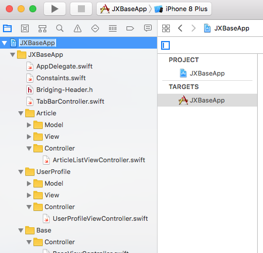

# 前言

最近公司换了老板，大搞（*瞎*）创（*折*）新（*腾*），各个部门更是撸起袖子加油干（*你懂的*）。一个多月时间，竟然连着干出了四五个App（*汗~~*）。
每次搭建项目架构都要从头来一遍，有不少工作是相同的，故而打算写个模板，以后直接拿来改一改就好了（*还是希望这种情况不要有以后了*）。
所以，这就引申出一个问题——如何完美修改项目名称。下面就以 JXBaseApp 为模板，修改项目名为 Juvenile。

**注意：如果是自己的项目重命名时，记得先备份好一份！**
**注意：如果是自己的项目重命名时，记得先备份好一份！**
**注意：如果是自己的项目重命名时，记得先备份好一份！**

**重要的事情说三遍**

------废话结束，操作步骤如下------

1. 我们将 JXBaseApp 项目 clone 之后，打开 Terminal 并切到项目根路径，安装 pod，命令 pod update（如果不久前更新了 local specs repositories，也可以 pod install，两者区别不想赘述，此处直接 pod update 即可），并打开 JXBaseApp.xcworkspace。 项目结构如图:

2. 在 Xcode 中修改项目名称，JXBaseApp 变成 Juvenile，选中项目名并按下回车，进入可编辑状态：

3. 输入新的项目名字，然后按回车，弹出改名前和改名后的文件对名，这时点击 Rename:

4. 打开项目文件夹，修改项目文件夹的名称，JXBaseApp 变成 Juvenile：

5. 关闭 Xcode，修改 Podfile 中 target 的 名称：

6. 将原来 JXBaseApp.xcworkspace 文件删除，并在 Terminal 中执行命令 pod install，生成新的 Juvenile.xcworkspace：
 --> 

7. 打开 Juvenile.xcworkspace，发现好多文件和文件夹都变红色找不到了，不要害怕：

8. 直接在 Xcode 中的Project Navigator 中 将 JXBaseApp 修改成 Juvenile，然后文件都回来了，哈哈哈

9. 全局修改项目名，在 Xcode 的 Find Navigator 中做 Replace，将 JXBaseApp 替换成 Juvenile：

10. 修改 info.plist 路径，在 Build Settings 中搜索 info.plist，修改路径如图：

11. 修改 bundle id：

12. 修改 Bridging Header 路径：

13. 删除原来的 libPods-JXBaseApp.a:

14. 至此，项目名修改完成，cmd + r 让小项目 run 起来：

## 作者
**Jiuxing Wang** *email: wangjiuxing2010@hotmail.com*

## License
JXBaseApp is released under MIT license. See LICENSE for details.
